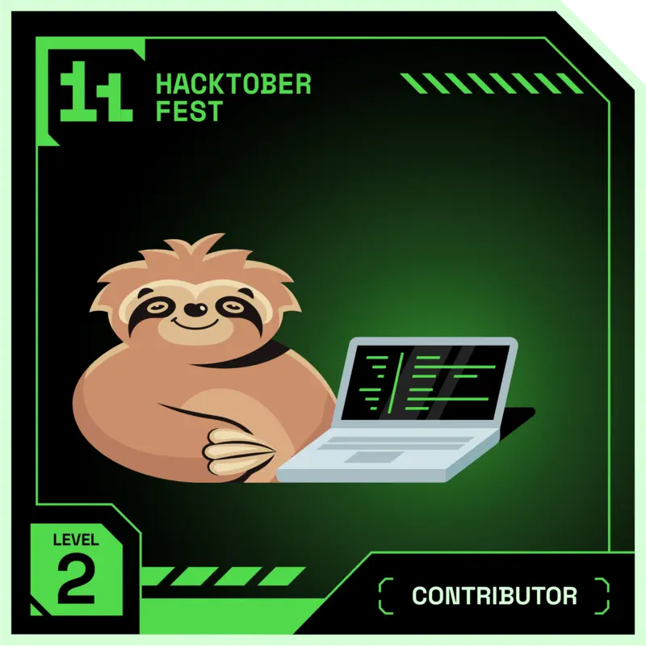
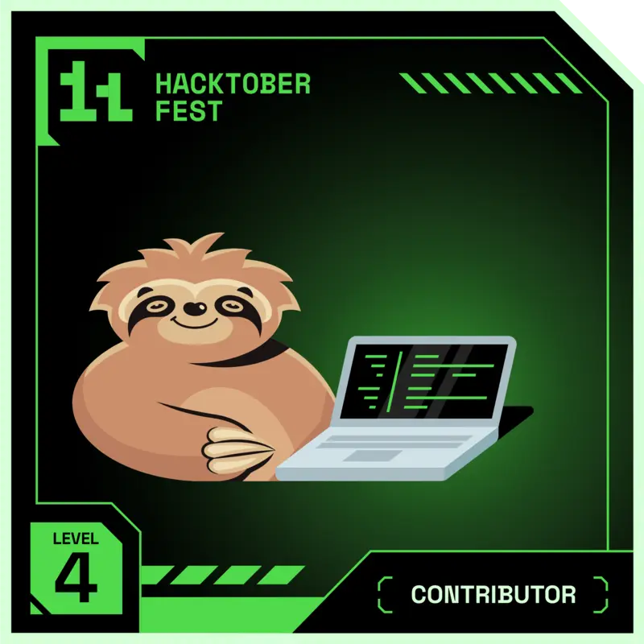
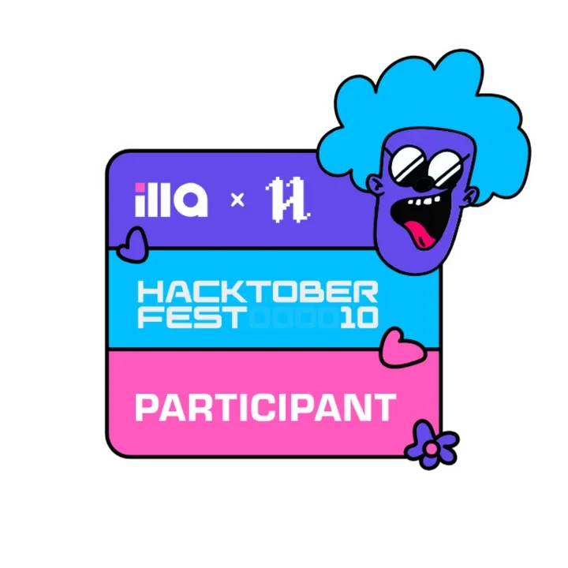
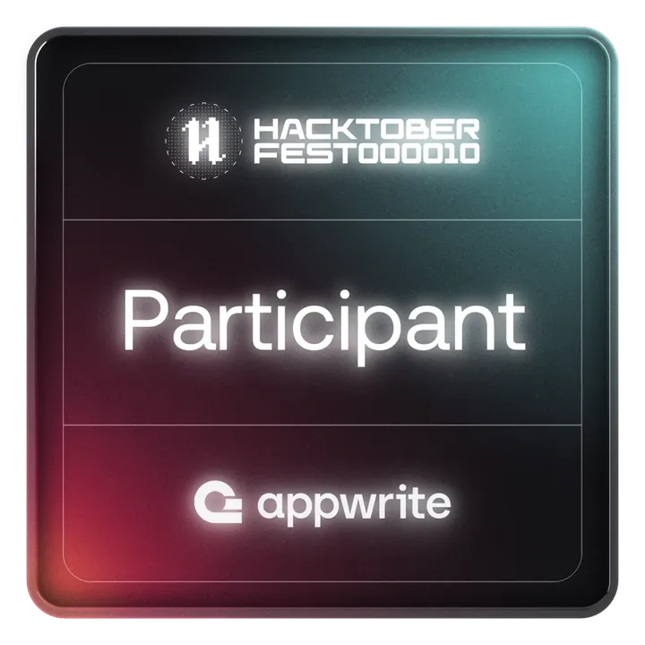
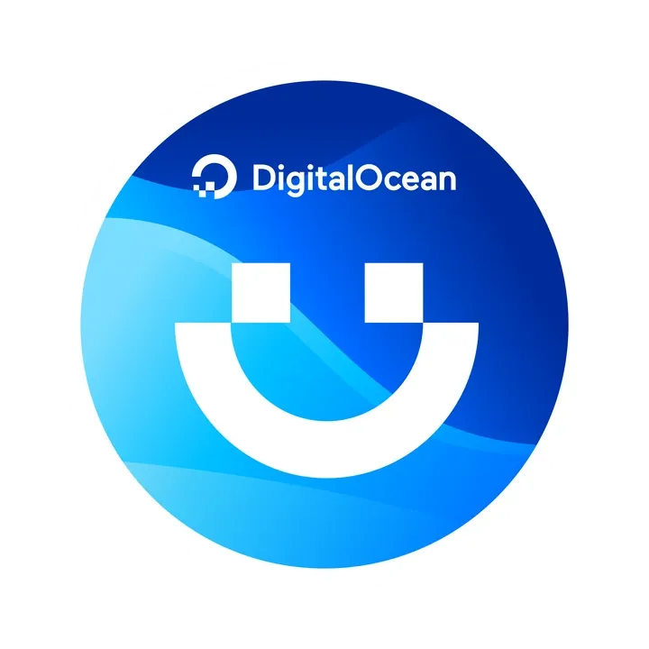
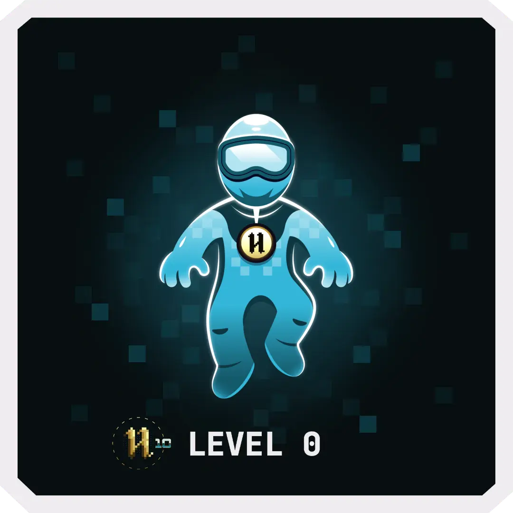
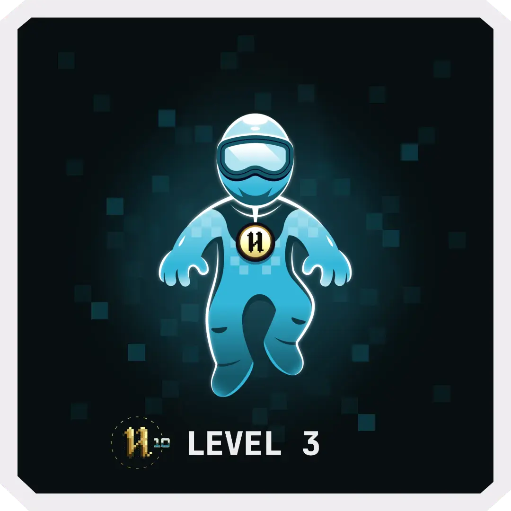
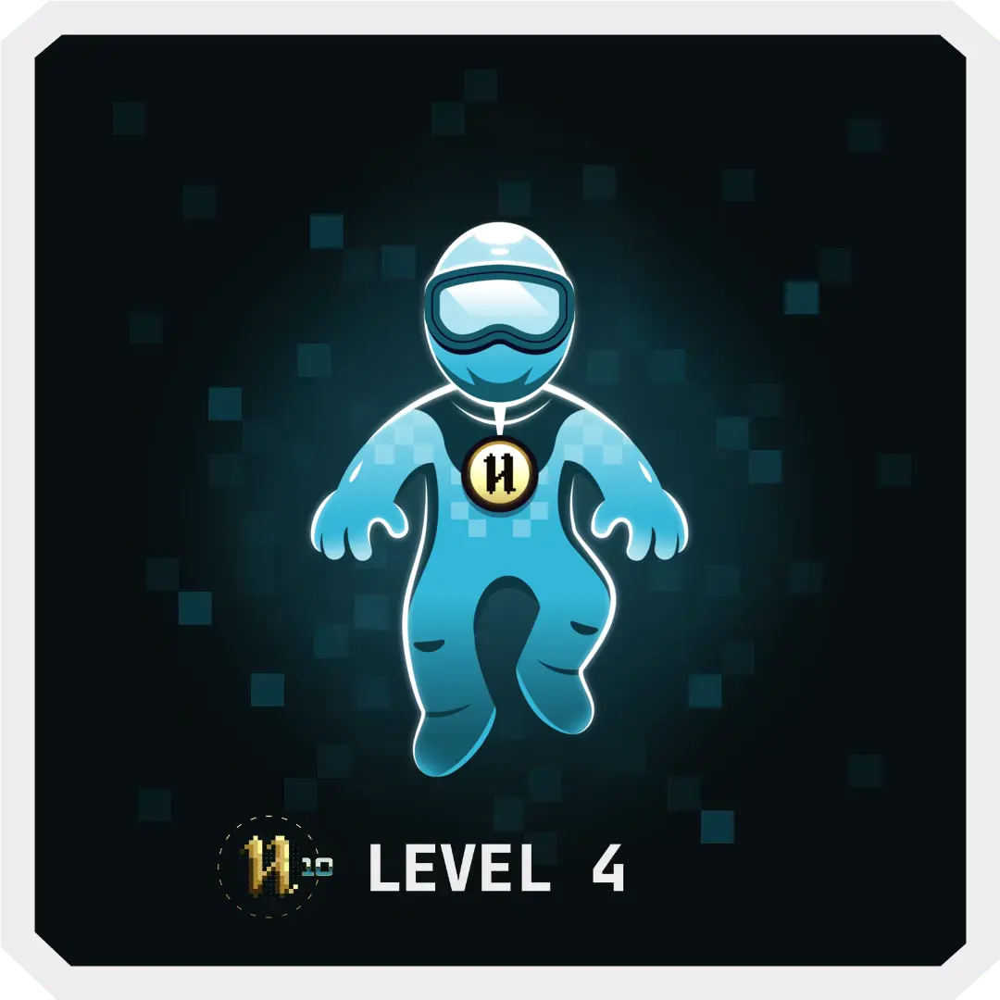

<h1 align="center">Hello 👋, I'm Ujjawal</h1>
<h3 align="center">A passionate developer from India</h3>

  

  

  

- 🔭 I’m currently working on **Web Development**

- 🌱 I’m currently learning **DSA and Development**

- 👯 I’m looking to collaborate on **different projects**

- ⚡ Fun fact **I love playing outdoor games like cricket**

<h3 align="left">Connect with me:</h3>

<h3 align="left">Languages and Tools:</h3>

                               

&nbsp;

<!--
## Hi there 👋

**ujjwalgupta2021/ujjwalgupta2021** is a ✨ _special_ ✨ repository because its `README.md` (this file) appears on your GitHub profile.

Here are some ideas to get you started:

- 🔭 I’m currently working on ...
- 🌱 I’m currently learning ...
- 👯 I’m looking to collaborate on ...
- 🤔 I’m looking for help with ...
- 💬 Ask me about ...
- 📫 How to reach me: ...
- 😄 Pronouns: ...
- ⚡ Fun fact: ...
-->

	

<b>🏆GSSOC Badges</b>

  
## GSSOC(24) Badges

<a href="https://gssoc.girlscript.tech/leaderboard">
  
  
  
  
  
  
  

	

<b>🏆Hacktoberfest Badges</b>

  
## Hacktoberfest 2024 Badges

<a href="https://holopin.io/@ujjwalgupta">
  
  
  
  
  

## Hacktoberfest 2023 Badges

<a href="https://holopin.io/@ujjwalgupta">
  
  
  
  
  
  
  
  
  

## Hacktoberfest 2022 Badges

<picture>
  <source media="(prefers-color-scheme: dark)" srcset="https://raw.githubusercontent.com/ujjwalgupta2021/ujjwalgupta2021/output/github-snake-dark.svg" />
  <source media="(prefers-color-scheme: light)" srcset="https://raw.githubusercontent.com/ujjwalgupta2021/ujjwalgupta2021/output/github-snake.svg" />
  
</picture>
